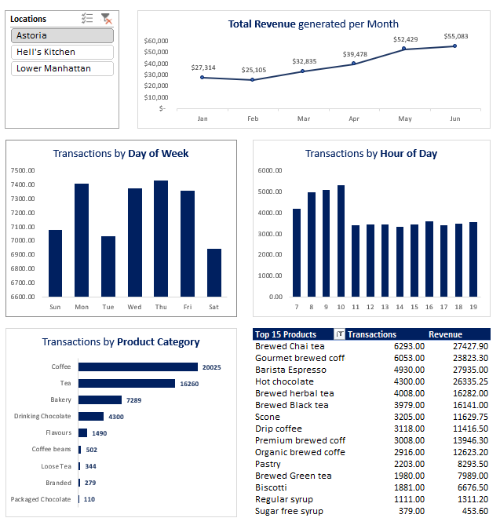

# ☕ Coffee Shop Sales Analysis (Beginner Project)

## 📌 Overview

This is a beginner-level data analysis project using Excel.
The goal of this project is to analyze coffee shop sales data and identify patterns in customer behavior, product performance, and sales trends.

---

## 📊 Dataset

The dataset contains transactional data with the following fields:

* Transaction Quantity
* Store Location
* Product Category & Type
* Unit Price
* Revenue
* Month, Weekday, and Hour

---

## 📈 Dashboard Features

The Excel dashboard includes:

* Monthly Revenue Trend 📅
* Transactions by Day of Week 📆
* Transactions by Hour of Day ⏰
* Sales by Product Category ☕
* Top 15 Products by Revenue 🏆
* Location-based filtering 📍

---

## 🛠 Tools Used

* Microsoft Excel (Pivot Tables, Charts, Slicers)

---

## 🔍 Key Observations

* Sales vary across different times of the day
* Certain product categories contribute more to revenue
* Weekly patterns can be observed in transactions

---

## 🎯 Project Objective

To practice data cleaning, analysis, and dashboard creation using Excel.

---

## 📸 Dashboard Preview

---

## 🚀 Future Improvements

* Add KPI metrics (Total Revenue, Avg Order Value)
* Perform analysis using SQL / Python
* Build an interactive dashboard using Power BI

---

## 🙌 Author

Shivam
